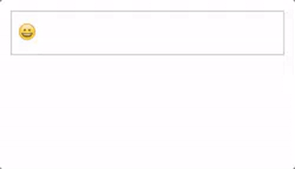
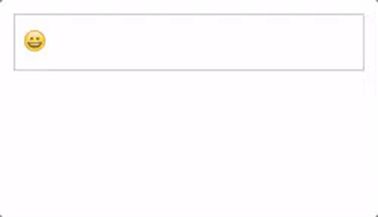

#  Growy [](https://npmjs.com/package/growy)

> Textarea-like web component which expands the height as the user types something [DEMO](https://zzarcon.github.io/growy)

### [Demo](https://zzarcon.github.io/growy)
  
  
  
  

### Features
  - 100% Web Component :sparkling_heart:
  - Dependency free :dizzy:
  - Does one thing right :ok_hand:
  - Works as you will expect :rocket:

### Usage
In order to make *Growy* work, you just need to require the module and set `is="growy-area"` into any textarea. Easy? :stuck_out_tongue_winking_eye:

```html
<textarea id="demo" is="growy-area"></textarea>
```

Additionaly, if you want to subscribe to any event, you can do it as you have always done it with other elements :sunglasses:

```javascript
require('growy');

const element = document.getElementById('demo');

element.addEventListener('onenter', function() {
  const value = this.value;

  //Do stuff with the textarea value
});
```

**Additional options**
  
  * **min-height** [default `50`] ```<textarea is="growy-area" min-height="100">```
  * **reset-onenter** [default `true`] ```<textarea is="growy-area" reset-onenter="false">```

**Events**
  
  * **onenter** Fired when the user hits `enter`. It handles when `shift` is presed and doesn't fires the event.

**Methods**

  * **reset** Will clear the textarea value and set the height to the original one (minHeight)

    ```javascript
    const element = document.getElementById('demo');

    element.reset();
    ```

      
### Installation

```
$ npm i growy
```

### Explanation and motivation

I know it may seem a stupid component, but I always wanted to have such component without any dependency and easy to use, my motivation was to build it in such way that you can just drop it in your app and start using it.

Also I tried to provide the easiest api possible, no api, since it uses WebComponents technology.

It also handles `shift` keys, which is nice.

### Extending

Let's say we want to create our custom Growy and add a behaviour in which whenever the user press the `DEL` key, we want to clear the value and set the original height. Simple as:

```javascript
const Growy = require('growy');

class CustomGrowy extends Growy {
  attachedCallback() {
    this.addEventListener('keydown', function(e) {
      if (e.keyCode === 8) { //DEL key
        this.reset();
      }
    })
  }
}

document.registerElement('custom-growy', {
  prototype: CustomGrowy.prototype,
  extends: 'textarea'
});
```

```html
<textarea is="custom-growy"></textarea>
```

Have fun!

### Browser support

Since Web Components are not really well supported yet in any other browser than Chrome, you will probably need to add the [Web Components Polyfill](https://github.com/webcomponents/webcomponentsjs) to your application.

### Author

[@zzarcon](https://twitter.com/zzarcon) :beers: